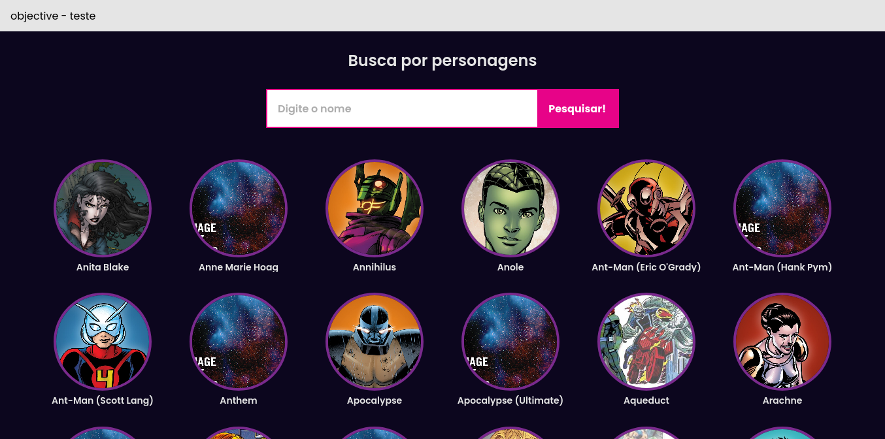
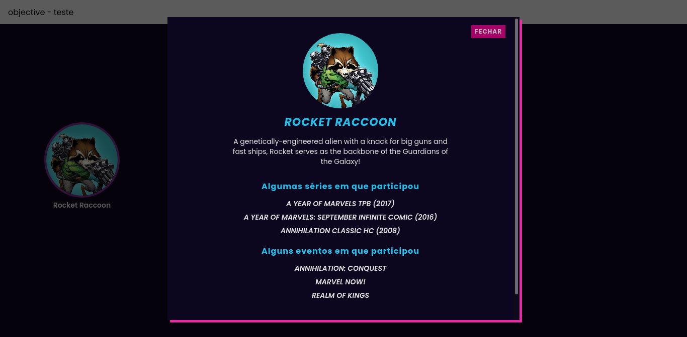
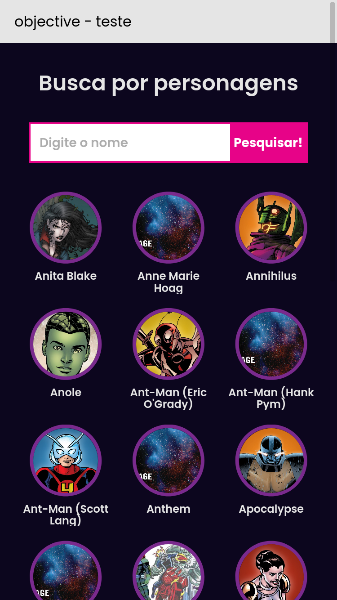

# :superhero: Code Hero

Mini projeto experimental usando dados da [Marvel API](https://developer.marvel.com/docs) para:

- Listar alguns personagens;
- Persquisar por nome de personagem;
- Exibir tela com detalhes do personagem (Descrição se houver, até 3 séries e eventos que o personagem tenha participado).

### Screenshots

<p align="center"></p>

<p align="center">Versão Desktop</p>

<p align="center"></p>

<p align="center">Modal com detalhes do personagem</p>

<p align="center"></p>

<p align="center">Versão responsiva</p>

## Demo

https://codehero-vanillajs.netlify.app/

## 🛠 Tecnologias usadas

- HTML5
- CSS (CSS Grid e Flexbox)
- JavaScript (Destructuring, `slice()`, `map()` e Fetch API)

## ⚠️ Problemas encontrados

- Fazer a API funcionar seguindo a fraca documentação;
- API lenta para testar no portal;
- Carregamento lento de imagens.

## 🚀 Desafios e lições

- Nunca tinha feito um app somente com JS puro sem depender do jQuery;
- Treinar conhecimentos com JS moderno;
- Treinar CSS Grid;
- Treinar Responsividade;
- Aprender mais sobre consumo de APIs RESTful.

## 📝 TODO

- [x] Testar formas de Lazy Loading;
- [x] Melhorar o README;
- [ ] Experimentar `commitizen`;
- [ ] Mudar a forma de busca para "nome começa com";
- [ ] Paginação;
- [ ] Refinar responsividade;
- [ ] Testes!

## API Reference

É necessário criar uma conta no [Marvel Developer Portal](https://developer.marvel.com/) para gerar as chaves para usar a API.

### Endpoints usados

#### Listar todos os personagens

```http
  GET /v1/public/characters
```

#### Busca por nome

```http
  GET /v1/public/characters?name=${characterName}
```

#### Carregar detalhes por id

```http
  GET /v1/public/characters/${characterId}
```
